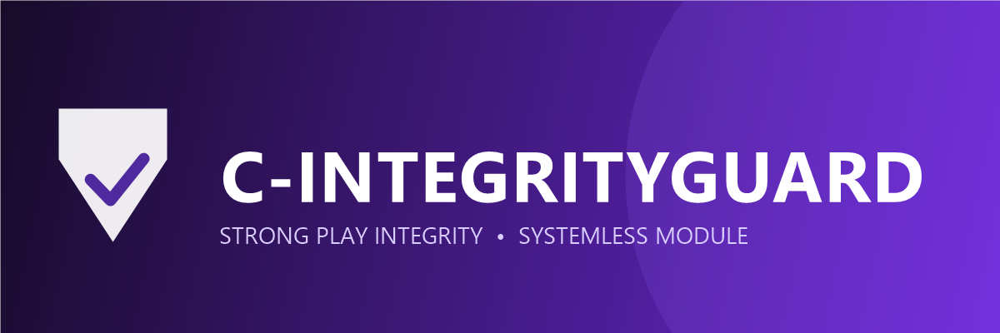

# C-IntegrityGuard

**Language:** [ja-JP/日本語](./doc/README_ja-JP.md)

A Systemless Module to get Strong Integrity so Easily.
Maintained by [Real-Casper](https://github.com/Real-Casper).

## How to get Strong Integrity ?
1. Install module [Play Integrity Inject](https://github.com/KOWX712/PlayIntegrityFix/releases/latest) or [Play Integrity Fork](https://github.com/osm0sis/PlayIntegrityFork/releases/latest)
2. Install module [Tricky Store](https://github.com/5ec1cff/TrickyStore/releases/latest)
3. Install **C-IntegrityGuard** by your root manager (Magisk/Apatch/KernelSU/Fork of KernelSU)
4. Press the action button

## ⚠️Attention
> [!NOTE]
>
> If you get errors similar to the ones below in action.sh or in module installations, you may need to install the modules below them.
>
> For the error on the side
>
> `ERROR: Tricky Store module not found!`:
> [Tricky Store](https://github.com/5ec1cff/TrickyStore/releases/latest)
>
> For the error on the side
>
> `ERROR: Keybox updated failed!`:
> [BusyBox](https://mmrl.dev/repository/grdoglgmr/busybox-ndk)

## Maintainer
[Real-Casper](https://github.com/Real-Casper)
